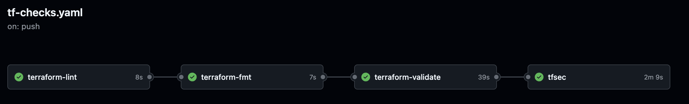

# Expense Tracker

An expense tracker is an app that analyzes and processes recorded expenses. It works by receiving a file with expense data, which is sent to a Lambda function for processing, with a large language model (LLM) serving as the backend for analysis.

This repository is structured into three primary components:

1. `infrastructure` – Contains Terraform code for provisioning resources like Lambda, S3, etc.
2. `service` – Holds the application code.
3. `oidc`-github – Manages the authentication flow between GitHub and AWS using OIDC.

### CI/CD Workflow

Automated CI/CD pipelines are set up in GitHub Actions to maintain code quality and deploy infrastructure. The processes include:

#### terraform Checks:

`tflint`: Linting for Terraform files.  
`terraform fmt`: Formatting the Terraform code. 
`terraform validate`: Validates the syntax of the Terraform code. 
`tfsec`: Security checks for Terraform code. 

On every push to the repository, the above Terraform checks are executed to maintain consistency and secure. 

#### provisioning Infrastructure:

A workflow is responsible for provisioning infrastructure using terraform.
The flow of provisioning infrastructure is terraform-init, terraform-plan and terraform-apply when manual-workflow is trigger:

#### Manual Approval for Production Deployments

Currently, for deploying to production or critical environments, manual approval is required. GitHub Actions doesn’t have a direct approach for manual approvals, so there are two main strategies:

Using External Action:  
The `trstringer/manual-approval@v1` github action raises an issue in the repository, type approve in comment box and confirm to proceed with the next steps.

Manual Workflow Trigger: 
Another approach is using the workflow-dispatch event, which allows manual triggering of workflows, as recommended by GitHub Docs.
For now, we are using the manual workflow trigger approach.

#### S3 Backend and State Locking

All state files for terraform are stored in an S3 backend. The backend configuration is organized by service path (e.g., lambda, s3), where each service has its own folder containing the respective state file in the s3 key.

State-locking is enabled in the terraform backend to avoid conflicts during concurrent writes. While terraform 1.10.x and above supports state-locking with the `use_lockfile` set to true, this feature is still experimental.

The current setup has state-locking enabled.

#### /ter.sh script:
This script is used to configure the backend based on different environments.

## usage:

1. Set up OIDC Authentication:

First, run oidc terraform locally and obtain the role arn of oidc.
Use this ARN in the GitHub Actions workflow to authenticate GitHub with AWS. 

Modify Terraform Configuration (if needed):

If any changes are required in the Terraform configuration, make them as needed. 
Push the changes to the repository. 
The Terraform workflow triggers automatically for the main and feature*  branches (depending on the configuration). 

Deploy to Critical Environments:

To deploy to production or other critical environments, trigger the manual workflow by using the workflow-dispatch event for manual approval.